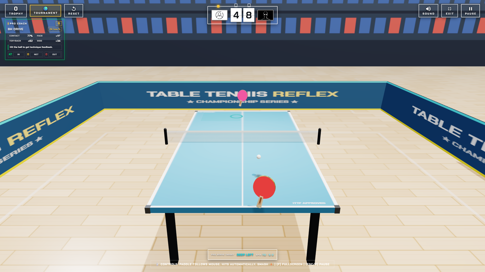

# Table Tennis Reflex

A browser-based 3D table tennis reflex game with tournament mode, coaching feedback, realistic ball physics, and audio effects.

## Gameplay

## Run locally

Open `index.html` in a modern browser, or run `StartGame.bat` on Windows.

## Controls

- Move the paddle with the mouse.
- Hits are triggered automatically when the ball reaches the paddle.
- Use `F` for fullscreen, `Esc` to exit fullscreen, and `P` to pause.
